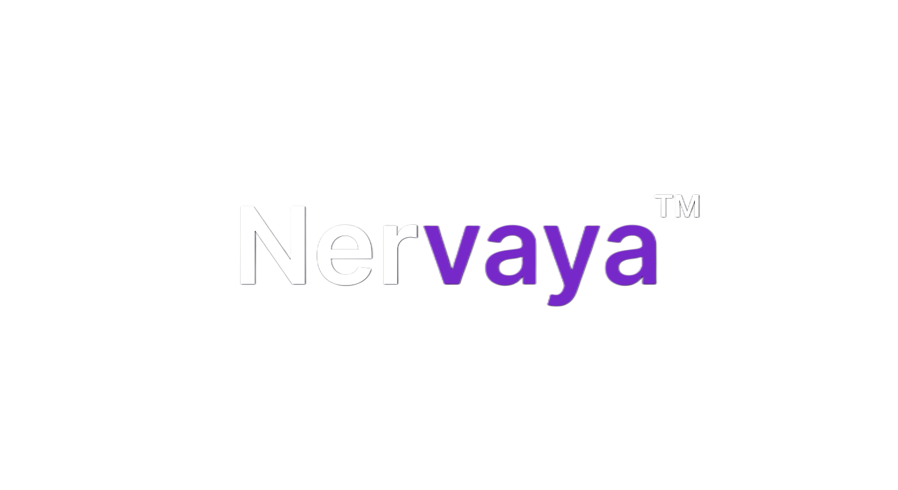
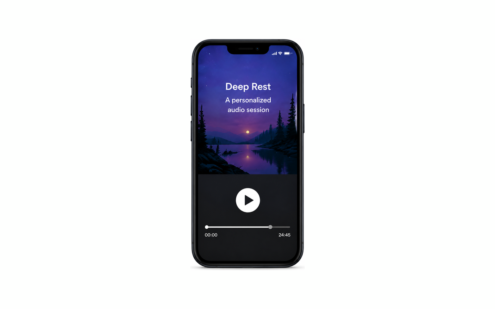
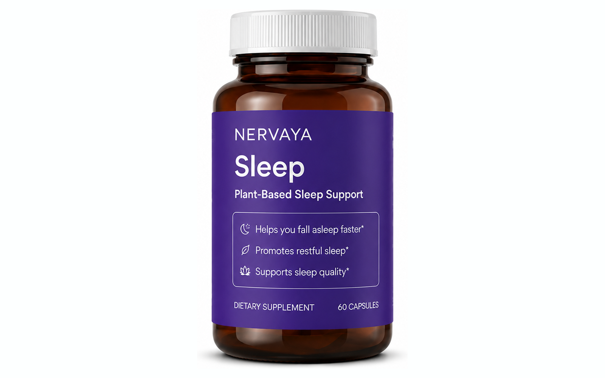
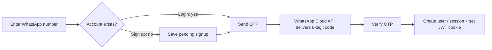

<p align="center">
  
</p>

<h1 align="center">Nervaya</h1>

<p align="center">
  A mental health and wellness platform — therapy, sleep programs, and supplements in one place.
</p>

<p align="center">
  
  
  
  
  
</p>

<p align="center">
  <a href="https://sonarcloud.io/summary/new_code?id=Nervaya_Nervaya"></a>
  <a href="https://sonarcloud.io/summary/new_code?id=Nervaya_Nervaya"></a>
  <a href="https://sonarcloud.io/summary/new_code?id=Nervaya_Nervaya"></a>
  <a href="https://sonarcloud.io/summary/new_code?id=Nervaya_Nervaya"></a>
  <a href="https://sonarcloud.io/summary/new_code?id=Nervaya_Nervaya"></a>
  <a href="https://sonarcloud.io/summary/new_code?id=Nervaya_Nervaya"></a>
</p>

---

## What is Nervaya?

Nervaya is a fullstack web platform that helps users take care of their mental health. It brings together three core offerings:

- **Therapy Corner** — Browse therapists, book consultations, and attend sessions
- **Deep Rest** — A guided sleep therapy program with assessments, video sessions, and progress tracking
- **Supplements Store** — Purchase wellness supplements with a full cart and checkout flow

Users sign up, take a sleep assessment, explore programs, and manage everything from their dashboard. Therapists and admins have their own dedicated portals.

<table>
  <tr>
    <td width="33%" align="center">
      <br />
      <strong>Deep Rest</strong><br />Guided sleep therapy
    </td>
    <td width="33%" align="center">
      <br />
      <strong>Supplements</strong><br />Cart &amp; checkout
    </td>
    <td width="33%" align="center">
      <br />
      <strong>Therapy Corner</strong><br />Book &amp; attend sessions
    </td>
  </tr>
</table>

## Passwordless WhatsApp Auth

Sign-up and login are **passwordless** — the user's WhatsApp number is the unique identity, and a one-time code is delivered over the **Meta WhatsApp Cloud API**. No passwords are stored.

<table>
  <tr>
    <td width="50%" align="center">
      <br />
      <strong>Sign up</strong> — name + WhatsApp number
    </td>
    <td width="50%" align="center">
      <br />
      <strong>Log in</strong> — WhatsApp number only
    </td>
  </tr>
</table>



Delivery status and inbound messages stream back via a Meta webhook (`/api/whatsapp/webhook`, HMAC-verified) and are persisted to MongoDB. When WhatsApp credentials are absent, the OTP falls back to the server console for local development.

## Tech Stack

| Layer        | Tech                                               |
| ------------ | -------------------------------------------------- |
| Framework    | Next.js 16 (App Router)                            |
| Language     | TypeScript (strict mode)                           |
| Database     | MongoDB + Mongoose                                 |
| Auth         | JWT (httpOnly cookies) + passwordless WhatsApp OTP |
| Messaging    | Meta WhatsApp Cloud API                            |
| Payments     | Razorpay                                           |
| File Storage | Cloudinary                                         |
| Styling      | CSS Modules                                        |
| CRM          | Zoho (lead tracking)                               |
| Code Quality | SonarCloud                                         |

Everything runs as a single Next.js app — no separate backend server. API routes live inside `src/app/api/`.

## Getting Started

### Prerequisites

- Node.js 18+
- MongoDB instance (local or Atlas)
- Meta WhatsApp Cloud API access (for auth OTPs — optional in dev, falls back to console)
- Razorpay account (for payments)
- Cloudinary account (for media uploads)

### Setup

```bash
# 1. Clone the repo
git clone https://github.com/Nervaya/Nervaya.git
cd Nervaya

# 2. Install dependencies
npm install

# 3. Create .env.local and add required variables
#    (MongoDB, JWT, WhatsApp Cloud API, Razorpay, Cloudinary)

# 4. Start the dev server
npm run dev
```

The app runs at `http://localhost:3000`.

### Other Commands

```bash
npm run build        # Production build
npm run lint         # Run ESLint
npm run lint:fix     # Auto-fix lint issues
npm run format       # Format code with Prettier
```

## Project Structure

```
src/
├── app/
│   ├── api/            # REST API route handlers
│   ├── (admin)/        # Admin dashboard pages
│   ├── (customer)/     # Customer-facing pages
│   └── (therapist)/    # Therapist portal pages
├── components/         # Shared UI components
├── context/            # React context providers
├── hooks/              # Custom hooks
├── lib/
│   ├── models/         # Mongoose schemas
│   ├── services/       # Business logic layer
│   ├── middleware/      # Auth & role-based access
│   └── utils/          # Shared utilities
├── queries/            # API client hooks
└── styles/             # Global CSS & theme variables
```

## License

All rights reserved.
